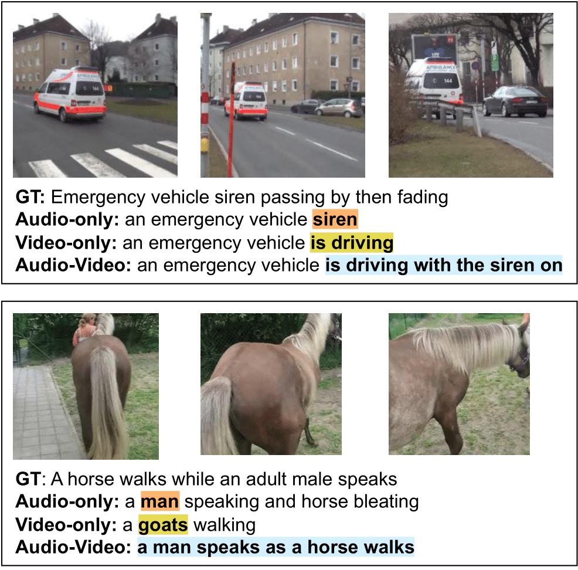

# [Interspeech2024] AVCap: Leveraging Audio-Visual Features as Text Tokens for Captioning


[](https://lbesson.mit-license.org/)
[](https://www.python.org/downloads/release/python-311/)
[](https://pytorch.org/get-started/previous-versions/#v21)
[](https://zenodo.org/doi/10.5281/zenodo.12737968)

This repository contains the source code of our paper [AVCap: Leveraging Audio-Visual Features as Text Tokens for Captioning](https://arxiv.org/abs/2407.07801) (Interspeech 2024). This code has been developed by referencing three repositories: [V-ACT](https://github.com/liuxubo717/V-ACT), [GiT](https://github.com/microsoft/GenerativeImage2Text), and [CAV-MAE](https://github.com/YuanGongND/cav-mae). Special thanks to the authors of these excellent previous works.

Also, if you are interested in audio-visual representation learning, please also check out our other work, [EquiAV](https://github.com/JongSuk1/EquiAV). We greatly appreciate your interest!

## Abstract
<p align="center">

In recent years, advancements in representation learning and language models have propelled Automated Captioning (AC) to new heights, enabling the generation of human-level descriptions. 
Leveraging these advancements, we propose **AVCap**, an **A**udio-**V**isual **Cap**tioning framework, a simple yet powerful baseline approach applicable to audio-visual captioning.
AVCap utilizes audio-visual features as text tokens, which has many advantages not only in performance but also in the extensibility and scalability of the model.
AVCap is designed around three pivotal dimensions: the exploration of optimal audio-visual encoder architectures, the adaptation of pre-trained models according to the characteristics of generated text, and the investigation into the efficacy of modality fusion in captioning. 

## Getting Started
### 1. Prepare Environment & Dataset
Create conda environment
```
conda env create -f avcap.yaml
conda activate avcap
```

To work with the [AudioCaps](https://audiocaps.github.io/) dataset in this project, ensure that you download and organize the files in the following structure within the `dataset` folder. Additionally, you should download the pretrained models from repositories [GiT](https://github.com/microsoft/GenerativeImage2Text), and [CAV-MAE](https://github.com/YuanGongND/cav-mae), and place them in the `pretrained_weights` folder. The subfolders should be organized as follows:

```
AVCap/
├── dataset/
|   ├── audiocaps
|       ├── train/
│           ├── frames/
│           └── waveforms/
|       ├── test/
│           ├── frames/
│           └── waveforms/
|   ├── train.json
|   ├── test.json
|   ├── test_coco.json
│   └── torch2iid.json
├── pretrained_weights/
|   ├── cav-mae-scale++.pth
|   ├── model_git_base.pt
|   ├── model_git_large.pt
│   └── model_git_large_r.pt
├── dataloader.py
├── run_avcap.py
├── scheduler.py
├── trainer.py
└── utils.py
```
Our preprocessed audiocaps dataset can be downloaded from this [link](https://drive.google.com/drive/folders/1yi1kAcChE-IS8-auQGVe_vt49o9yN0u2?usp=sharing).


### 2. Training

We train our model on a single node environment with 8 RTX 4090 GPUs. We use the CAV-MAE scale++ model as the audio-visual encoder, text decoder from GiT model as the text decoder. You can choose whether to train each part or not using the **freeze_av** and **freeze_text** options.

```
CUDA_VISIBLE_DEVICES=0,1,2,3,4,5,6,7 python -u -W ignore run_avcap.py \
    --lr 1e-4 --batch-size 8 \
    --num_frames 4 \
    --target_length 1024 --noise True \
    --av_pretrain_path pretrained_weights/cav-mae-scale++.pth \
    --text_pretrain_path pretrained_weights/model_git_base.pt \
    --save_path [path to save model] \
    --freeze_text \
    --modality_specific_depth 11 \
    --no_wandb
```
If you wish to use a pretrained audio-visual encoder, you must set the modality-specific depth appropriate for that model. For the pretrained text decoder, you can download and use the `git_base`, `git_large`, and `git_large_r` models.
